

<h1>💙</h1>
<h1>Hello, This is Fortune.</h1>

I am studying Computer Science and Engineering in CNU.

 

<h1>⏰</h1>
<h1>TimeLine</h1>

Last Update : 20220316

__2019__

<h3>🦦실리콘벨리 단기연수🦦</h3>

충남대학교 컴퓨터융합학부 SW사업단

2019.07.31 - 08.06

고등학교 3년 내내 수시로 생물학과를 바라봤던 나에게
 컴퓨터공학과로서 새로운 인생의 전환점이 된 경험.

1학년 중 12명이 참가하였고, 1학기때 백준 문제 풀이에
 미쳐있던 덕분에 연수에 참가할 기회를 얻을 수 있었다.

실리콘벨리에서 진행되는 51Conference와 Post Conference에 참여.
 기업들의 최신 기술과 후배들에게 전하고 싶은 이야기를 주제로 특강을,
 그리고 UX에 대해 배우고 디자인 스프린트를 진행.

만나뵌 모든 개발자와 디자이너분들이
 코딩 실력은 기본이며 논리적인 소프트스킬을 강조.

그들의 끊임없는 공부와 시도를 본받자.

꿈만 같았던 실리콘벨리 유명 기업 투어와 처음 감각한 미국의 모습,
 그리고 밤낮으로 열심히 준비하고 참여한 멋진 동기들이 기억이 남는다.

해당 포스트로👇

<figure>
  <a href = "https://sinyoung3016.tistory.com/entry/%EC%8B%A4%EB%A6%AC%EC%BD%98%EB%B2%A8% EB%A6%AC-%EB%8B%A8%EA%B8%B0%EC%97%B0%EC%88%98-01-City-Tour?category=517927">
    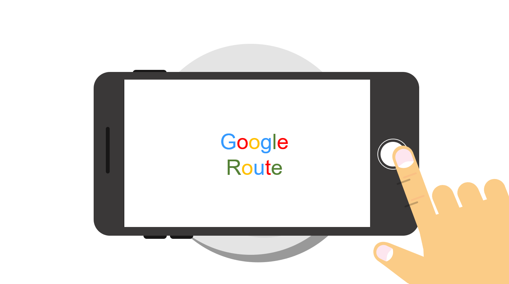
  </a>
  <figcaption>Post Conference에서 제작한 Prototype 일부</figcaption>
</figure>

 

<h3>🧜‍♂️Salesforce(Singapore) Tour🧜‍♂️</h3>

2019.08.28

51 컴퍼런스의 마케팅 관련 특강이 인상 깊어서,
 기회가 되어 싱가포르에 있는 세일즈포스 기업 투어를 신청.

기업을 대상으로 영업 및 마케팅 서비스를 판매하는 회사로,
 본사는 실리콘벨리에 있으며, 싱가포르 지사는 동남아시아를 타겟으로 함.

다양한 국적의 사람들이 팀을 이룬 모습이 너무 좋았다.
 시원하고 진취적인 분위기의 실리콘벨리와 달리,
 따뜻한 기후 덕분인지 부드러운 분위기가 느껴졌다.

또한 퇴근 시간의 싱가포르 도심이 너무 아름다워서,
 언젠가 싱가포르에서 일을 하며 살아가고 싶다는 생각을 했다.

 하루종일 일 그리고 취미로 열심히 코딩하고, 야경보면서 맥주마시고 귀가하고파.

<figure>
   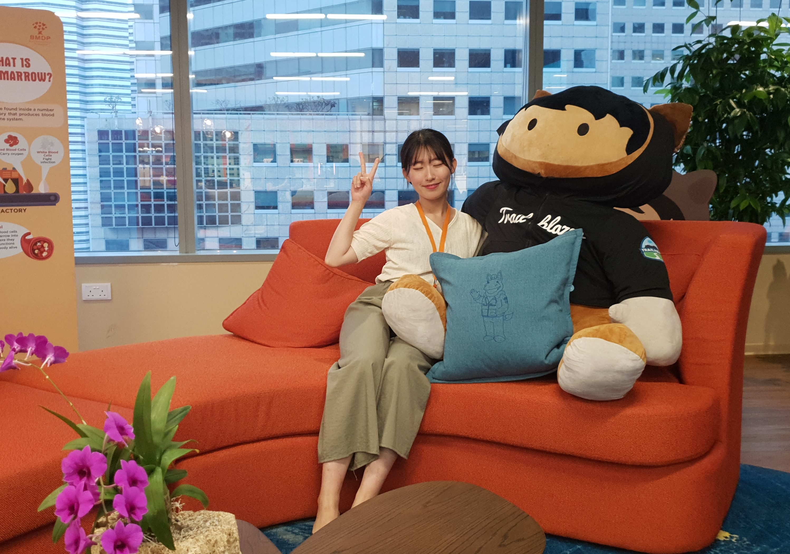
  <figcaption>Salesforce</figcaption>
</figure>

 

<h3>🧸TermProject : HelloBooks🧸</h3>

충남대학교 컴퓨터융합학부

2019.11 - 2019.12

나의 두번째 프로젝트이자, GUI를 가지는 첫번째 프로젝트.
 데모 발표가 끝나고, 교수님께서 극찬을 해주셨다.

Java를 사용하여 제작한, 동기화를 지원하는 프로젝트로
 우리가 만든 프로그램은 중고책을 거래하는 프로그램(실행파일)이다.

 아직까지 나랑 가장 협업이 잘 된다고 생각한 친구와 함께 만든 두번째 작품.

<figure>
   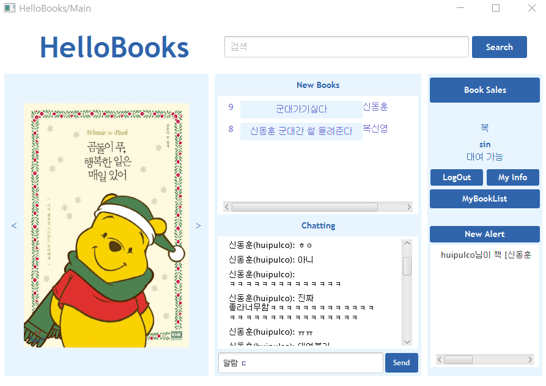
  <figcaption>HelloBooks</figcaption>
</figure>

 

---

__2020__

<h3>❓2020 BottomUp 경진대회 : GuessWhat❓</h3>

충남대학교 컴퓨터융합학부 SW사업단

2020.06 - 2020.08

창업동아리에서 구상한 앱을 축소하여 구현.
 이전에 계획한 것을 일부라도 구현한 것에 의의.

초반에 많은 회의를 통해 기반을 단단히 구성하고자 노력했다.
 그러나 계획은 자의든 타의든 바뀔 수 있더라.

하나만 바라보며 집중하여 나아가는 것도 좋지만,
 새로운 경험과 다양한 시도를 받아드리면
 더 좋은 길을 찾을 수도 있다는 것을 잊고 있었다.

프로덕트의 목적을 달성하는 과정에서 더 좋은 수단과 방법이 있다면
 유연하게 계획을 수정하는 것이 좋다.

<figure>
   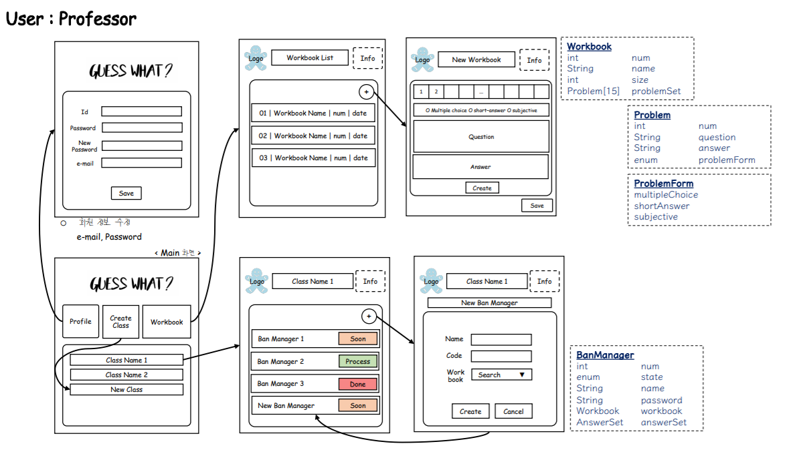
  <figcaption>GuessWhat 계획서 일부</figcaption>
</figure>

 

<h3>🧩생각하는 프로그래밍 대회 출제자🧩</h3>

충남대학교 컴퓨터융합학부 AnA

2020.09.26

항상 풀기만 하던 알고리즘 문제를 출제자의 입장에서 바라보는 경험.

나의 의도와 제시문이 부합한지, 예외는 없는지.
 의도한 풀이에 맞는 기준 시간과 메모리가 적절한지.
 현재 답안보다 더 좋은 풀이가 있는지.
 아래의 간단한 문제를 만들기 위해, 수 많은 고민을 했다.

출제한 문제는 간단한 DP를 이용한 문제로, 아래 링크를 달아 놓았다.

  

해당 문제로👇

<figure>
  
  <figcaption>백준</figcaption>
</figure>
  

해당 포스트로👇

<figure>
  <a href = "https://sinyoung3016.tistory.com/entry/4th-Thinking-PC?category=517926">
    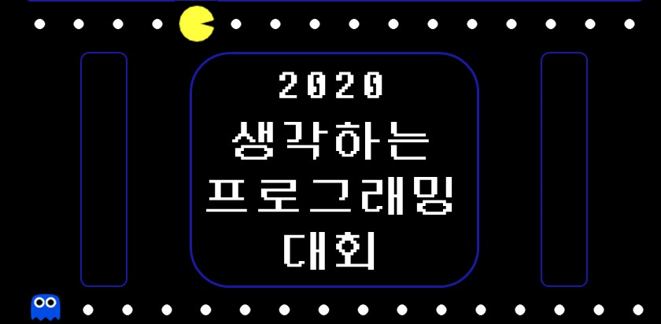
  </a>
  <figcaption>제 4회 생각하는 프로그래밍 대회 포스터 일부</figcaption>
</figure>

 

<h3>🍎서비스 디자인 이노베이션 부트캠프 참가🍎</h3>

undermaru

2020.12.23 - 2021.01.22

디자인은 특정 목적을 가지고 설계하고 구현하는 것을 의미.

UX 디자인의 상위 개념인 서비스 디자인을 기반으로 하여
 5주동안 디자인 스프린트를 진행.

UX 디자인 스프린트는 유저의 요구에 집중 한다면,
 서비스 디자인 스프린트는 유저의 요구는 물론,
 이를 통해 사회적 가치를 창출한다는 차이가 존재.

'음식물 쓰레기'를 주제로 하여 일상을 되돌아보는 계기도 되었으며,
 여러 전공의 참여자들의 다양한 생각을 들을 수 있는 경험.

단순히 문제의 원인과 결과를 제거하는 것 자체에 집중하는 것뿐만 아니라,
 이를 가공하여 새로운 가치를 창출하는 방식이 인상 깊다.

해당 포스트로👇

<figure>
  <a href = "https://sinyoung3016.tistory.com/entry/Service-Design-Camp?category=517926">
    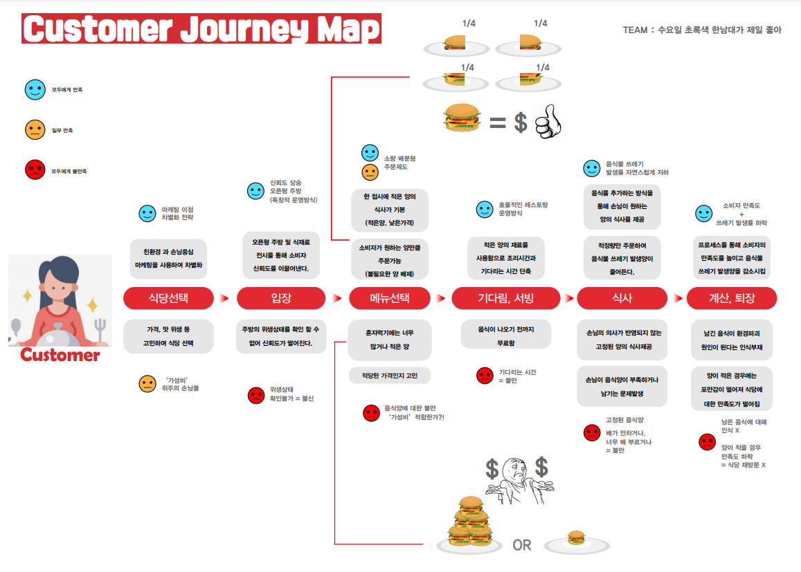
  </a>
  <figcaption>Customer Journey Map</figcaption>
</figure>

 

---

__2021__

<h3>🏃‍알고리즘 동아리 : AnA 회장🏃</h3>

2021.01 - 2021.12

1학년 때부터 몸담아 온 알고리즘 동아리, AnA의 21년도 회장을 내가!

친구가 동아리 폐지를 권유할 정도로, 진짜 아무것도 없는 상태에서 시작했다

  

하지만 동아리 성과 발표회에서 8개의 동아리 중 3등을 하고,
 60명이 넘는 동아리원을 얻었고,
 다음 년도의 후배들에게 새로운 동아리방을 줄 수 있었다.

  

21년도의 가장 큰 노력과 성과

  

+ 노력을 발표하는 능력 또한 정말 중요
 + 숫자는 노력을 보여줄 수 있는 최고의 방식

해당 포스트로👇

<figure>
  <a href = "https://sinyoung3016.tistory.com/entry/AnA-%EC%95%8C%EA%B3%A0%EB%A6%AC%EC%A6%98-%EB%8F%99%EC%95%84%EB%A6%AC%EB%A5%BC-1%EB%85%84-%EB%8F%99%EC%95%88-%EC%9A%B4%EC%98%81%ED%95%B4%EB%B3%B4%EC%9E%90?category=517926">
    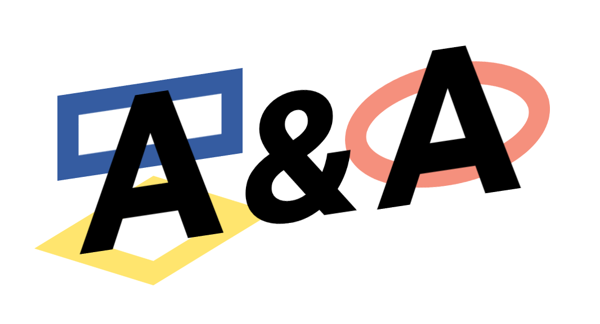
  </a>
  <figcaption>AnA Logo</figcaption>
</figure>

 

<h3>🔥2021 AnA 디자인 스프린트 캠프 기획 및 운영🔥</h3>

2021.03.13 - 2021.03.14

두 번의 스프린트 경험을 기반으로 내가 꼭 열어보고 싶었던 캠프

  

내가 배웠던, 정말 좋았던 내용들을 다른 학생들에게도 알려주고 싶었다.

행사 관련 서류도 작성하고, 포스터도 제작하고, 장소 섭외하고, 일정 계획하고,
 다과와 준비물 구매하고, 발표 자료 만들고, 캠프를 기획 및 진행

  

본격적인 캠프가 진행된 이틀은 몸도 정신도 정말 힘들었다.

  

그런데 열심히 참여하는 친구들을 보니까 진짜 너무 뿌듯했다.
 캠프 종료 후, 대부분의 학생들이 설문조사로 좋은 평가를 남겨주었다.

  

기획과 운영이 정말이지 어렵다는 것을 몸소 깨달았고,
 앞으로 참여하는 모든 행사에 최선을 다해 적극적으로 활동해서
 운영자들을 뿌듯함으로 감동시키겠다.

해당 포스트로👇

<figure>
  <a href = "https://sinyoung3016.tistory.com/entry/Design-Sprint-Camp?category=517926">
    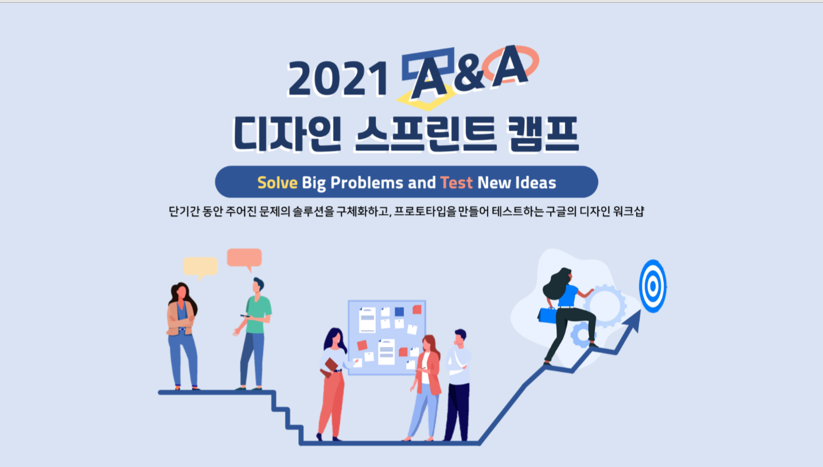
  </a>
  <figcaption>디자인 스프린트 캠프 포스터</figcaption>
</figure>

 

<h3>👩‍🎓HCI Lab의 학부생 연구원👩‍🎓</h3>

HCI : Human & Computer Interaction

2021.05 - 2022.07(예정)

      

아래와 같은 주제를 가설로 둔 연구를 진행중
 "비대면 진료에서 '의료진이 진단한다'고 생각하게 유도하면 처방 순응도가 좋아진다"

결국 사람이 사용하는 제품을 만드는 것이므로, 
 사람이 필요로 하여야 하며,
 개발자의 의도에 사용자가 자연스럽게 따라갈 수 있는 상호작용이 매우 중요

  

아직은 공부중
  
  

해당 프로젝트 노션으로👇

<figure>
  <a href = "https://boundless-witch-e2a.notion.site/Human-Computer-Interaction-Lab-fe36f7fbc51b4b73bad4fc0d1858fcfd">
    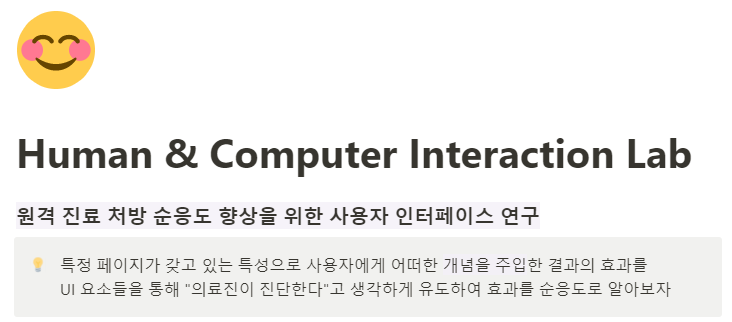
  </a>
  <figcaption>HCI Notion</figcaption>
</figure>
  

해당 프로젝트 포스트로👇

<figure>
  <a href = "https://sinyoung3016.tistory.com/entry/RemotePrescriptionApp?category=517926">
    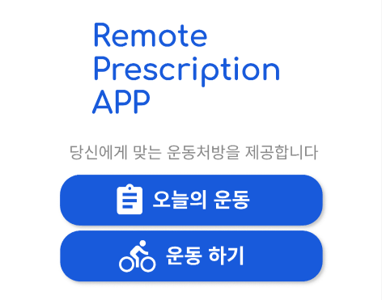
  </a>
  <figcaption>Remote Prescription Application</figcaption>
</figure>
  

  
 

---

__2022__

 

<h3>🌏6기 글로벌 AI*SW 인재 트랙 : 해외 대학 연수 프로그램 참여🌏</h3>

Purdue University

2022.01 - 2021.2

두 달 동안 해외 대학교를 visiting scholar로 살아보기

프로젝트도 진행하고 논문을 작성하는 것이 주요 활동. 
 하지만 난 학교 돌아다니고, 청강하고, 해외 친구들이랑 이야기하는 것을 더 즐겼다.
 (물론 팀 내에서 주어진 역할은 책임감을 가지고 다 했다!)

가장 좋았던 경험을 고르자면,
 발표에 자신이 없는 내가 영어로 완벽하게 발표한 것
  

해당 일상 포스트로👇

<figure>
  
  <figcaption>Life In Purdue</figcaption>
</figure>
  

해당 프로젝트 포스트로👇

<figure>
  <a href = "">
    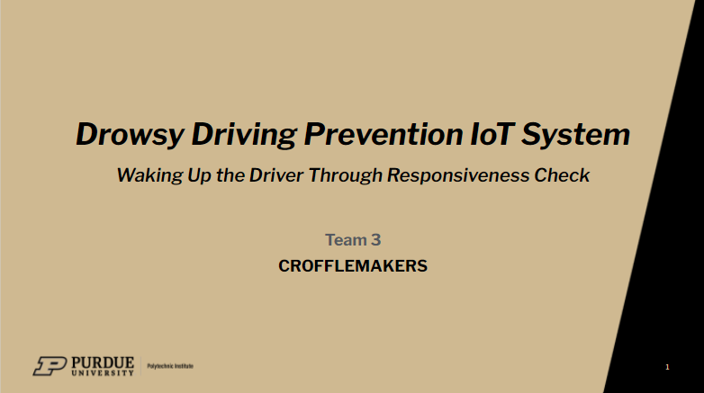
  </a>
  <figcaption>CroffleMakers</figcaption>
</figure>
  

  
 
  

<h3>졸업 프로젝트 : CNU-FOSS</h3>

Chung-nam National University

2022.01 - 2022.12()

LG의 FOSSLight를 활용한 학내 자산관리 프로그램 개발

해당 프로젝트 노션으로👇

<figure>
  
  <figcaption>CNU-FOSS Notion</figcaption>
</figure>
  

해당 프로젝트 포스트로👇(예정)

<figure>
  
  <figcaption>CNU-FOSS</figcaption>
</figure>
  

     

